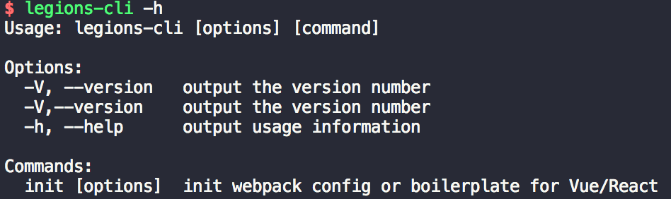
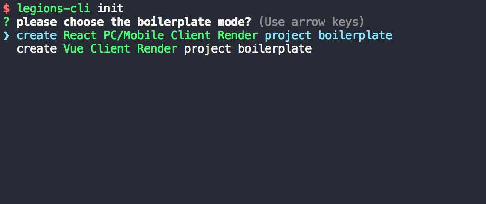
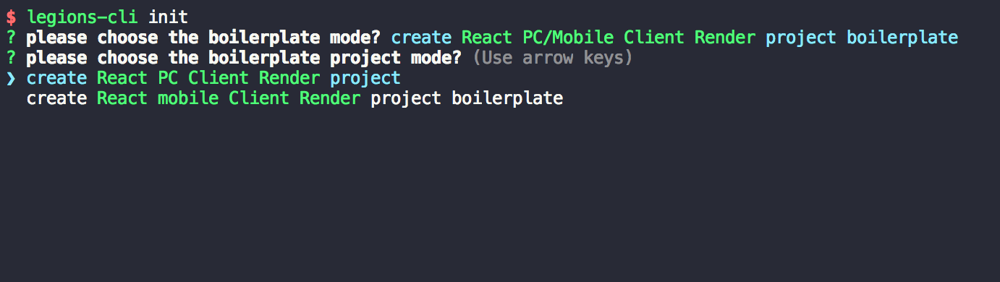

# legions-cli

legions cli 命令行工具 , 支持常用react,vue,移动端等骨架的初始化

# 一.特性
- 支持vue 项目初始化
- 支持react(PC/移动端)项目初始化
- 小程序项目创建
- SSR项目初始化
- NodeJs服务端项目初始化
- 未来会有更多功能持续开放

# 二.安装

```js
npm i legions-cli -g
# OR
yarn global add legions-cli
```

# 三. 运行

```js
legions-cli -h
# or
legions -h
```


# 四. 常用命令介绍

### 4.1配置模板和Boilerplate初始化

- legions init

> step one:



> step two:



# 五. License
[MIT](LICENSE)


